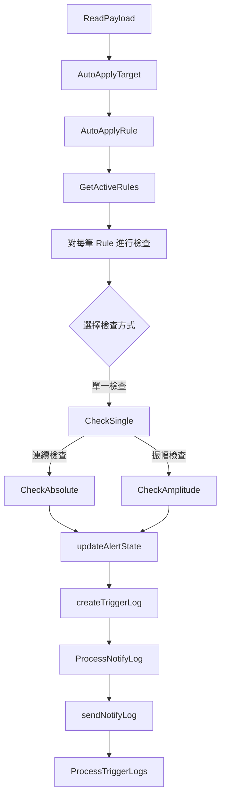
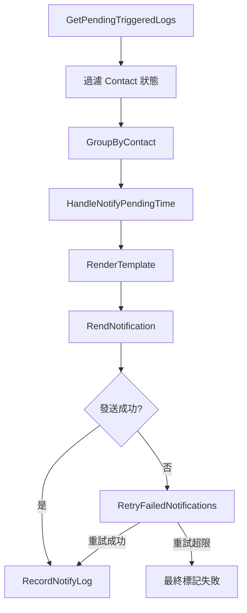

# 架構規劃

系統拆分成 **兩個主要服務**：

1. **`AlertService`**：負責接收告警數據、匹配規則、檢查異常、記錄觸發日誌
2. **`NotificationService`**：負責篩選通知、渲染模板、發送通知、記錄通知日誌

> 流程概覽
>
> - `AlertService` → **檢查異常、記錄觸發日誌**
> - `NotificationService` → **發送通知、記錄通知日誌、失敗則註冊 `retry` 發送任務**

---

## **服務拆解說明**

## **1️⃣ Alert Service**

📌 **步驟：預載、匹配、goroutine 檢查、更新狀態、記錄觸發日誌**

**主要負責**

- **接收** `AlertPayload`
- **預載** 監控規則，匹配告警對象 (`AutoApplyTarget`)、告警規則 (`AutoApplyRule`)
- **依照 `Rule` 併發執行**：
  - `CheckSingle()` 檢查異常 (`CheckAbsolute / CheckAmplitude`)
  - `updateAlertState()` 更新 `rule_states`
  - `processTriggerLog()` 記錄觸發日誌

### **🔹 Alert Service 內部流程**

| **功能**                  | **描述**                                          |
| ------------------------- | ------------------------------------------------- |
| **`CheckPayload()`**      | 初步驗證 `AlertPayload`                           |
| **`AutoApplyTarget()`**   | 自動匹配監控對象                                  |
| **`AutoApplyRule()`**     | 自動匹配告警規則                                  |
| **`GetActiveRules()`**    | 查詢符合條件的規則                                |
| **`CheckSingle()`**       | 執行異常檢測 (`CheckAbsolute` / `CheckAmplitude`) |
| **`updateAlertState()`**  | 更新 `rule_states`                                |
| **`processTriggerLog()`** | 建立 `TriggeredLog` 記錄                          |

## **2️⃣ Notification Service**

📌 **步驟：查詢、分組、渲染模板、發送通知、記錄發送日誌、失敗則 `retry`**

**主要負責**

- **查詢 `TriggeredLog`，過濾 `ContactState`**
- **將通知分組 (`ContactID`)，併發發送**
- **渲染對應 `Template`**
- **發送通知 (`Webhook, Email, Slack`)**
- **記錄 `NotifyLog`**
- **通知失敗則 `retry` (`RetryDelay & MaxRetry`)**

### **🔹 Notification Service 內部流程**

| **功能**                         | **描述**                                                   |
| -------------------------------- | ---------------------------------------------------------- |
| **`GetTriggeredLogs()`**         | 查詢未發送通知的 `TriggeredLog`                            |
| **`GroupByContact()`**           | 按 `ContactID` 分組                                        |
| **`RenderTemplate()`**           | 依 `FormatType` 渲染模板 (`HTML / Markdown / JSON / Text`) |
| **`SendNotification()`**         | 發送通知 (`Webhook, Email, Slack`)                         |
| **`RecordNotifyLog()`**          | 記錄 `NotifyLog`                                           |
| **`RetryFailedNotifications()`** | `retry` 機制 (`RetryDelay & MaxRetry`)                     |

---

## **核心狀態碼**

✅ **需要確認每個狀態都有正確應用**

| **表名 / 欄位**                   | **狀態**   | **描述**                        |
| --------------------------------- | ---------- | ------------------------------- |
| **`rule_states.rule_state`**      | `alerting` | 異常發生中                      |
|                                   | `resolved` | 告警已恢復                      |
|                                   | `normal`   | 正常狀態                        |
|                                   | `disabled` | 規則未啟用                      |
| **`rule_states.contact_state`**   | `normal`   | 正常通知                        |
|                                   | `silence`  | 進入 `silence_period`，暫停通知 |
|                                   | `disabled` | 通道未啟用                      |
| `triggered_logs**.notify_state**` | `sent`     | 異常訊息發送成功                |
|                                   | `solved`   | 恢復訊息發送成功                |
|                                   | `pending`  | 等待 `notify_pending_time`發送  |
|                                   | `delayed`  | 延遲發送                        |
|                                   | `failed`   | 失敗，等待 `retry`              |

---

# **內建 YAML**

- **`metric_rule.yaml`** → **定義監控指標規則**
- **`template.yaml`** → **定義通知模板**

---

# **MySQL 資料庫結構**

✅ **需要確認每個欄位都有正確更新**

| **表名**         | **用途**     |
| ---------------- | ------------ |
| `realms`         | 租戶管理     |
| `targets`        | 監控對象     |
| `contacts`       | 通知通道     |
| `rules`          | 規則設定     |
| `rule_states`    | 當前規則狀態 |
| `triggered_logs` | 觸發日誌     |
| `notify_logs`    | 通知日誌     |

---

## 傳送 `AlertPayload.json`

```json
{
  "metadata": {
    "realm_name": "master",
    "datasource_type": "oracle_tablespace_script",
    "resource_name": "PSAPUNDO",
    "timestamp": 1725072363
  },
  "data": {
    "total_space_bytes:ADV:SYSAUX": [
      { "timestamp": 1725072303, "value": 485394.0 },
      { "timestamp": 1725072363, "value": 485592.0 }
    ],
    "total_space_usage:ADV:SYSAUX": [
      { "timestamp": 1725072303, "value": 63.0 },
      { "timestamp": 1725072363, "value": 63.0 }
    ]
  }
}
```

## `Alert` Service

## 1. ReadPayload

**目的：**

- 檢查 payload 格式 metadata 跟 data

**重點：**

- metadata.data 逐筆 key 分割 [0]:[1] key[0]=metric 取得 key[1]= partition_name
- 從 metadata 的 realm_name 跟 datasource_name 跟 resource_name 跟 partition_name 向 DB 取得 targets ，targets ids 取 rules , rule_states
- 如果 data 沒有匹配到 target 代表新加入沒有設定規則， rules 取 auto_apply = true 進行設定自動加入規則，新 target 根據 datasource_name 跟 key[0]=metric 匹配 metric_rule 的 uid 得到 rule ，然後批量新增 rule
- 先查詢 Rules，但不預載 Contacts 觸發時再批量查詢 Contacts

## 2. AutoApplyTarget

**目的：**

確保收到的 alert 對應的 target 在資料庫中存在，若不存在則自動新增 target。

**重點：**

- 檢查 payload 中的 target 資訊
- 如 target 不存在，進行自動申請與記錄

---

## 3. AutoApplyRule

**目的：**

對於新加入的 target，若資料中未匹配到現有規則，則依據 auto_apply 標誌自動套用對應的 rule。

**重點：**

- 根據 datasource_name 與 key[0]（metric）比對 MetricRules 的 uid
- 批量新增或更新符合 auto_apply 條件的 rule

---

## 4. GetActiveRules

**目的：**

從資料庫中讀取當前 active 的規則與其對應的 RuleState，確保檢查基礎資料完整。

**重點：**

- 根據 realm、resource 等關鍵資訊查詢對應的 Rules
- 同時取得對應的 MetricRules（靜態規則）與 RuleStates（動態狀態）

---

## 5. CheckSingle(Absolute,Amplitude)

### CheckSingle

**目的：**

- 根據 detection_type 選擇檢查方法（absolute/amplitude）

針對單一數據點進行檢查，確定是否立即觸發告警邏輯。

**流程：**

- 將 alert.Value 乘上 metricRule.Scale 得到當前值
- 根據 operator（如 gt、lt）比對 Threshold
- 返回是否「exceeded」與當前計算的 triggeredValue

### 5.1 CheckAbsolute(rule, Data)

**目的：**

逐筆檢查最新 N 筆數據，確認所有數據均超過閾值後進行觸發。

**流程：**

-
- 比對 value 與不同等級的 threshold (crit_threshold/warn_threshold/info_threshold)
- 計算異常持續時間：`now - first_trigger_at`
- 根據 operator (< or >) 判斷異常
- 依嚴重度順序判斷 (crit → warn → info)
- 讀取最新 N 筆數據
- 驗證每筆數據是否均符合條件（大於或小於閾值）
- 若所有數據滿足，計算 StackDuration（now - FirstTriggerTime）
- 判斷是否超過預設持續時間 duration，決定是否觸發

### 5.2 CheckAmplitude(rule, Data)

**目的：**

檢查最近 N 筆數據的振幅變化是否超出 Threshold。

**流程：**

- 計算 max_value 與 min_value
- 計算振幅：`(max - min) / min * 100`
- 與 threshold 比對判斷是否異常
- 讀取最新 N 筆數據，計算 max 與 min
- 計算 amplitude = ((max - min) / min) \* 100
- 判斷振幅值是否超過設定值，並計算 StackDuration
- 若持續時間符合，觸發告警

---

## 6. updateAlertState(rule, triggeredValue, currentTime)

**目的：**

根據檢查結果更新該 rule 的狀態（alerting / normal / resolved），並記錄必要的時間與觸發值資訊。

1. **靜音機制**
   - 使用 silence_start_at 和 silence_end_at 控制靜音期間
   - 靜音期間不發送通知，但仍記錄告警

- 首次異常時設定 first_trigger_at
- 持續異常更新 last_trigger_at
- 恢復時設定 state = “normal” 或 “auto_resolved”
- 使用 diff 方法僅更新變動欄位

**流程：**

- **異常分支：**
  - 若當前檢查結果為異常，更新：
    - `FirstTriggerTime`（若尚未記錄）
    - `LastTriggerTime`
    - `TriggerValue`
    - 計算  `StackDuration = now - FirstTriggerTime`
    - 若 StackDuration 超過 Duration，將 RuleState 更新為 alerting
- **恢復分支：**
  - 若檢查結果回復正常，則：
    - 清除 FirstTriggerTime
    - 將 RuleState 更新為 normal/resolved
    - 更新 TriggerLog 的 resolved_at（或 closed_at，視 closed_type 而定）
- **DB 優化：**
  - 採用 diff 更新，只寫入有變化的欄位，減少 DB 寫入成本

---

## 7. processTriggerLog(rule, alert, currentState) **Create or Update**

**目的：**

根據 Rule State **判斷 需要 Create 還是 Update** TriggerLog，記錄當前告警快照

- 記錄完整 rule_snapshot 與 rule_state_snapshot
- 根據 contact_state 決定通知策略
- 記錄 triggered_value 和 threshold 值
- 異常恢復時更新 resolved_at
- 手動關閉時更新 closed_at 和 closed_by

## **判斷的邏輯**

```
1. 當 rule_state = normal -> alerting：
   - 產生新的 TriggeredLog，並更新 rule_state = alerting
   - 記錄 last_triggered_log_id 為該次觸發的 log_id
2. 當 rule_state = alerting：
   - 更新該次 TriggeredLog，記錄異常變化
   - 不更新 last_triggered_log_id（持續異常）
3. 當 rule_state = resolved：
   - 標記 TriggeredLog.resolved_at
   - 清空 last_triggered_log_id
```

## `Alert`Service Flow



---

## `Notification` Service

## 1. 查詢與過濾 (GetPendingTriggeredLogs)

- 主要職責：
  透過 GetPendingNotifications 函式，選出所有滿足條件的 TriggeredLog 作為通知處理的原始資料。
- 功能：
  從資料庫中查詢所有符合以下條件的 TriggeredLog：
  - Timestamp 小於當前時間（告警已產生）
  - 聯絡方式狀態非 mute
  - 當前時間大於寂靜期（SilenceEnd）
  - NotifyState 為 nil 或 pending（尚未通知）
  - ResolvedTime 為 0（告警仍處於異常狀態）
- 決策重點：
  - 僅返回滿足所有條件的記錄，避免重複或錯誤通知。
  - 作為後續分組與合併的基礎資料來源。

---

## 2. 分組合併 (GroupByContact)

- 主要職責：
  利用 GroupByContact 將相同聯絡人的告警記錄合併，降低通知重複性並優化 API 調用。
- 功能：
  根據查詢結果依照 contact_id（及必要時 channel_type）進行分組，將多筆 TriggeredLog 整合合併成一筆 NotifyLog。
- 決策重點：
  - 合併相同聯絡人的多筆告警資訊（如告警摘要、發生時間、嚴重度）。
  - 減少通知請求，降低系統壓力，同時提高使用者的訊息可讀性。

---

## 3. 模板渲染 (RenderTemplate)

- 主要職責：
  使用 RenderTemplate 將合併後的資料根據聯絡人偏好與設定渲染成最終通知內容。
- 功能：
  根據聯絡人或規則設定的 FormatType 將合併後的告警資料渲染成最終通知內容。
- 流程與決策：
  - 模板選擇： 根據設定選用 HTML、Markdown、JSON 或 Text 模板；若未指定則預設為 Text。
  - 數據映射： 將合併後的 TriggeredLog 資料（異常類型、發生時間、影響範圍、摘要等）傳入模板引擎進行渲染。
  - 錯誤處理： 模板渲染失敗時回傳錯誤，觸發重試或記錄錯誤訊息。

---

## 4. 通知發送 (SendNotification)

- 主要職責：
  通過 SendNotification 依據不同渠道發送通知，並結合 worker pool 控制並發數量以保障系統穩定性。
- 功能：
  將渲染後的通知內容透過對應的渠道（Webhook、Email、Slack 等）發送給目標聯絡人。
- 流程與決策：
  - 渠道調用： 根據聯絡人設定選擇合適的 API 呼叫方法。
  - 超時與錯誤捕捉： 設定合理的超時機制，捕捉網絡異常或 API 錯誤。
  - Worker Pool 控制： 使用 worker pool 限制同時發送的通知數量，避免過量併發導致系統不穩。

---

## 5. 通知日誌記錄與狀態更新 (RecordNotifyLog)

- 主要職責：
  RecordNotifyLog 負責將發送結果記錄下來，並同步更新 TriggeredLog 狀態（例如從 pending 變為 sent 或記錄失敗信息）。
- 功能：
  將通知發送的結果記錄在 notify_logs 中，並更新相關 TriggeredLog 狀態（如將 pending 變為 sent 或標記失敗）。
- 決策重點：
  - 狀態同步： 同時更新 TriggeredLog 與 NotifyLog，建立雙向關聯（例如記錄 notify_log_id）。
  - 原子性更新： 確保資料庫操作原子性，避免狀態不一致。
  - 累計重試： 當發送失敗時累計 retry_counter，並記錄最後重試時間（last_retry_time）。

---

## 6. 重試機制 (RetryFailedNotifications)

- 主要職責：
  若發送失敗，RetryFailedNotifications 定期檢查失敗記錄並根據重試延遲與重試次數條件，重新嘗試發送，直至成功或超出重試上限。
- 功能：
  針對發送失敗的 NotifyLog 進行重試，確保通知最終能夠送達。
- 流程與決策：
  - 重試條件： 檢查 last_retry_time 與 retry_delay 是否到期，且 retry_counter 未超過 max_retry。
  - 重試流程： 如果條件滿足，重新呼叫 SendNotification；成功後更新狀態為 sent，失敗則累加重試次數並更新 last_retry_time。
  - 分離機制： 通過獨立的 Retry Worker 定時（例如每分鐘）掃描失敗記錄，避免重試操作影響新通知的發送。

---

## 7. 延遲通知機制 (HandleNotifyPendingTime)

- 主要職責：
  透過 HandleNotifyPendingTime 檢查並管理延遲通知機制，確保只有在延遲期滿且告警持續的情況下，才進入後續通知流程。
- 功能：
  當 TriggeredLog 剛產生時，根據配置的 notify_pending_time 決定是否延遲發送通知，避免短時間內頻繁發送。
- 流程與決策：
  - 檢查延遲設定： 若 notify_pending_time = 0，則立即進入通知流程；若大於 0，則進入等待狀態。
  - 等待監控： 在延遲期間內持續檢查 rule_state：
    - 若在等待期間異常恢復（rule_state = resolved），則取消通知，將 TriggeredLog 標記為 ignored。
    - 若延遲期結束且仍為 alerting，則轉為 pending，進入後續通知流程。

## \*\*\*\*`Notification` Service Flow


